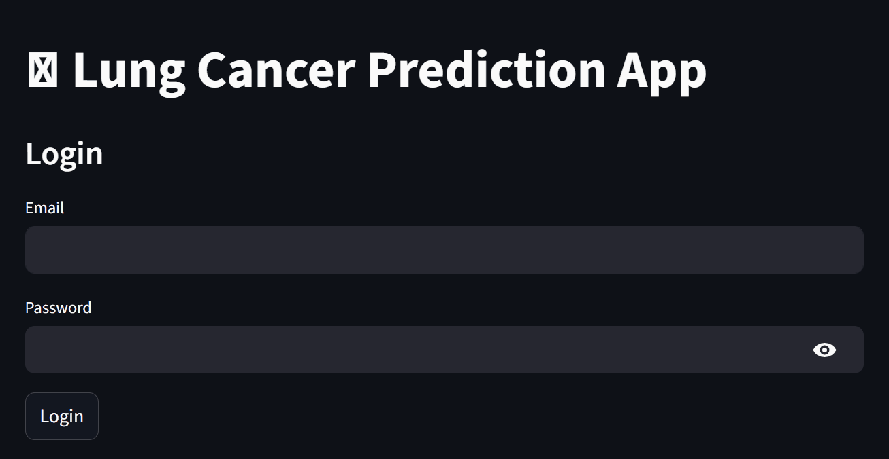
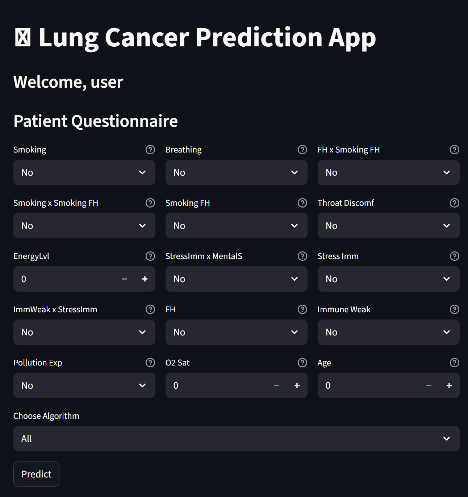
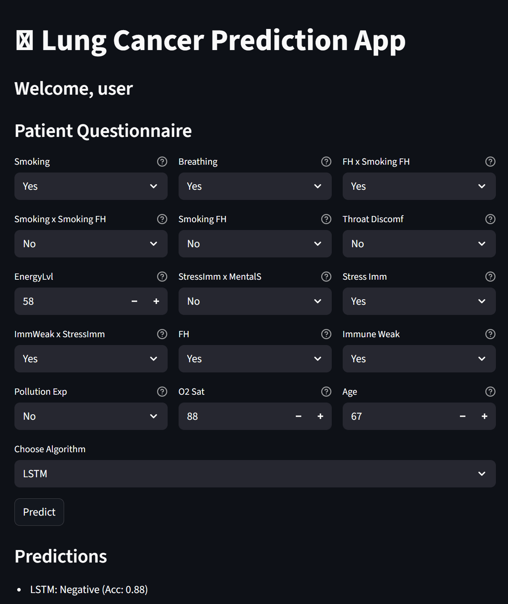
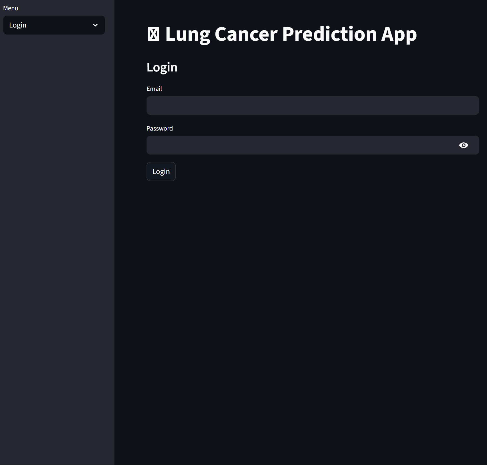

---

# 🫁 Lung Cancer Prediction System

This project provides a **deep data insight pipeline** and a **Streamlit-powered prediction application** for lung cancer risk assessment. It combines exploratory data analysis, feature engineering, multiple machine learning/deep learning models, and deployment of trained models into a user-friendly web interface.

---

## 📑 Project Structure

* **`Ifeoma Okonma_Final Project.ipynb`**
  Jupyter Notebook containing:

  * Data preprocessing & feature engineering.
  * Exploratory data analysis (EDA) for identifying correlations and risk factors.
  * Training of multiple ML/DL algorithms.
  * Saving trained models in different formats (`.keras`, `.h5`, `.tflite`, `.joblib`).

* **`streamlit_lung_cancer_predictor_app_app.py`**
  Streamlit application for lung cancer prediction.

  * Uses `.keras` and `.joblib` models for live predictions.
  * Provides user registration, login, and personalized prediction history.
  * Includes an **admin panel** for managing global prediction records.

* **Model files**

  * **Deep Learning Models (Keras)**: `best_lstm_model.keras`, `best_gru_model.keras`, `best_mha_model.keras`.
  * **ML Models (Joblib)**: `xgboost_model.joblib`, `logistic_regression_model.joblib`, `random_forest_model.joblib`, `linear_regression_model.joblib`, `k_nearest_neighbors_model.joblib`.
  * **Scaler**: `scaler.pkl` for preprocessing new inputs.
  * **Additional formats**: `.h5` and `.tflite` versions (prepared for portability and embedded systems).

---

## 🎯 Why This Approach?

The assessment adopts a **multi-model ensemble approach** because:

1. **Deep Insights**:

   * Extensive EDA was performed to capture key predictors of lung cancer (e.g., smoking, pollution exposure, family history).
   * Feature interactions (e.g., `Smoking x Family History`) were engineered to uncover hidden risk patterns.

2. **Diverse Algorithms**:

   * Classical ML models (Logistic Regression, Random Forest, XGBoost) provide explainability and fast inference.
   * Deep Learning models (LSTM, GRU, Multi-Head Attention) capture non-linear dependencies and temporal-like interactions between features.

3. **Robust Deployment**:

   * Models saved in multiple formats (`keras`, `h5`, `tflite`, `joblib`) ensure compatibility with **cloud apps, edge devices, and production pipelines**.
   * The Streamlit app integrates both classical and deep models for real-time predictions.

---

## 🚀 Streamlit Application

### Features

* **User Authentication**: Register/login to access personal dashboard.
<p align="center">
   
</p>
* **Patient Questionnaire**: Input health indicators (e.g., age, smoking, oxygen saturation, family history).
<p align="center">
   
</p>
* **Multi-Model Predictions**:

  * Run predictions with **all models** or a **selected algorithm**.
<p align="center">
  
</p>
  * Display accuracy benchmarks for transparency.
  * Consensus voting when multiple models are selected.
* **History Tracking**:

  * Users can view, expand, and delete their own past prediction records.
  * Predictions are timestamped and saved with input features.
* **Profile Management**: Update personal details such as age.
* **Admin Dashboard**: Manage all users’ prediction history.
<p align="center">
  
</p>


---

## 🛠️ How to Run Locally

### 1. Clone the Repository

```bash
git clone <repo_url>
cd <repo_folder>
```

### 2. Install Dependencies

It is recommended to use a virtual environment.

```bash
pip install -r requirements.txt
```

**Main dependencies**:

* `streamlit`
* `tensorflow`
* `scikit-learn`
* `xgboost`
* `joblib`
* `pandas`, `numpy`

### 3. Ensure Model & Data Files Exist

Place the following in the project directory:

* Trained model files (`*.keras`, `*.joblib`, `scaler.pkl`)
* Data directory: `app_data/` containing `users.json` and `history.json` (auto-created if missing).

### 4. Run Streamlit App

```bash
streamlit run streamlit_lung_cancer_predictor_app_app.py
```

### 5. Access in Browser

Default: [http://localhost:8501](http://localhost:8501)

---

## 📘 Application Usage

1. **Register/Login**

   * New users can register with email, name, and password.
   * Existing users can log in.

2. **Dashboard**

   * Fill in the questionnaire.
   * Choose **one model** or **All Models**.
   * Click **Predict** → Results with model accuracies are displayed.
   * Consensus prediction shown when multiple models are selected.

3. **History**

   * View all your past predictions.
   * Expand to inspect details.
   * Delete individual or all records.

4. **Profile**

   * Update age or other personal information.

5. **Admin Panel**

   * Accessible only to **admin users**.
   * View all prediction records in a table.
   * Delete history by:

     * All users
     * Specific user
     * Specific timestamp

---

## 🔑 Admin Access

* Admins are defined inside the app (`ADMIN_USERS` list in code).
* Default admin:

  ```
  Email: admin@example.com
  Password: (set during first registration with this email)
  ```
* Once registered with the above email, login and you’ll see the **Admin** tab in the sidebar.

---

## 📊 Example Workflow

1. User registers → logs in.
2. Completes questionnaire → selects `RandomForest`.
3. Gets prediction: **Positive (Accuracy: 0.90)**.
4. History is saved under their account.
5. Admin logs in → checks all predictions → deletes one suspicious record.

---

